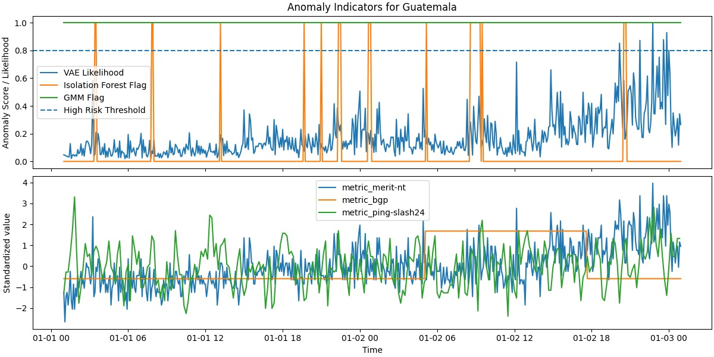

# 🌍 UptimeAI: Network Outage Predictions

UptimeAI is a machine learning project designed to predict upcoming **network outages** using data from **IODA (Internet Outage Detection & Analysis)**. It leverages **Variational Autoencoders (VAE)**, an **unsupervised anomaly detection** technique, to detect potential downtimes based on recent network anomalies in the geographic area. The system is deployed as a **FastAPI backend** that serves real-time predictions.

---

## 🚀 **Project Overview**
### **1️⃣ Data Sources**
- **IODA API** 🛰️ (Network outage signals from multiple data sources)
- **City Geolocation Data** 🌍 (Latitude/Longitude for regional modeling)
- (Future addition: **OpenWeather API** 🌦️ (For real-time weather impact analysis))

### **2️⃣ Machine Learning Models**
- **VAE (Variational Autoencoder)** ️ - quantifies the abnormality of patterns in connectivity metrics
- **GMM (Gaussian Mixture Model)** (clusters normal vs anomalous patterns) and **Isolation Forest** (Identifies outliers in historical data) are also included in the model training code but did not perform as well and were thus excluded from the deployed backend.

### **3️⃣ Backend API (FastAPI)**
- **Fetches latest IODA data**.
- **Preprocessing and feature calculation**.
- **Runs inference with trained VAE models** based on the last 20 minutes of connectivity data from IODA within a 150km radius from each prediction zone.
- **Returns predictions as JSON** for instant frontend access.

---

## 🛠 **Installation**
### **1️⃣ Clone the Repository**
```sh
git clone https://github.com/aarongerston/UptimeAI.git
cd UptimeAI
```

### **2️⃣ Set Up Virtual Environment**
```sh
python3 -m venv venv
source venv/bin/activate  # On Windows: venv\Scripts\activate
pip install -r backend_reqs.txt  # for backend
pip install -r training_reqs.txt  # for model training
```

---

## 🚀 **Running the Backend API**
### **Start FastAPI Locally**
```sh
uvicorn main:app --host 0.0.0.0 --port 8080 --reload
```
- Open **http://127.0.0.1:8080/docs** to test API.

### **API Endpoints**
| Endpoint  | Description |
|-----------|------------|
| `/predict`  | Fetches latest data & returns outage likelihood |

---

## 🤖 **Training the Models**
### **1️⃣ Train VAE, GMM, Isolation Forest**
1. Modify functions/config.py to suit your needs
2. Run
```sh
python functions/train_models.py
```

### Example Output

Below is an example of the indicators and model predictions for Guatemala:




---

## 🌍 **Deploying on Google Cloud**
### **1️⃣ Deploy FastAPI on Cloud Run** (Current implementation)
```sh
gcloud run deploy uptime-ai \
    --image gcr.io/YOUR_PROJECT_ID/backend \
    --platform managed \
    --region europe-southwest1 \
    --allow-unauthenticated
```

### **2️⃣ Set Up a Cloud Function for Scheduled Predictions** (Future work...)
```sh
gcloud functions deploy store-predictions \
    --runtime python312 \
    --trigger-http \
    --entry-point store_predictions \
    --timeout 120s \
    --allow-unauthenticated \
    --region europe-southwest1
```

### **3️⃣ Set Up Cloud Scheduler (Every 5 Minutes)** (Future work...)
```sh
gcloud scheduler jobs create http uptime-ai-job \
    --schedule "*/5 * * * *" \
    --uri "https://YOUR_CLOUD_FUNCTION_URL" \
    --http-method=GET
```

---

## 📜 **License**
This project is licensed under the **MIT License**.

---

🔗 **Live API**: [https://uptime-ai-510434762087.europe-southwest1.run.app/docs](https://uptime-ai-510434762087.europe-southwest1.run.app/docs)  
💬 **Questions?** Open an issue or contact us at **aarongerston@gmail.com**. 🚀
```

